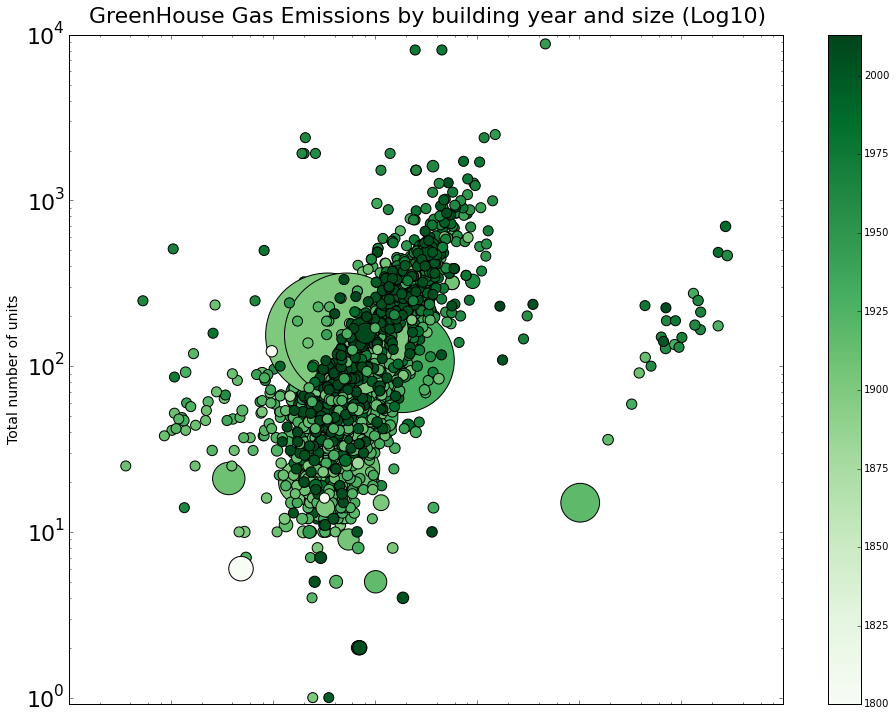

It is nice how there are different size variations between the dots, however the size of the 3 big circles in the center of the background are a bit distracting. I'd suggest adding a legend and a better description of the axis to show all labels. I'm not used to reading the year on the right side, I'd move it to the bottom x-axis and portray the map horizontally. Although I like the concept of green color as the greenhouse gas emissions, the contrast in color needs to be more defined, making it easier to differentiate. 