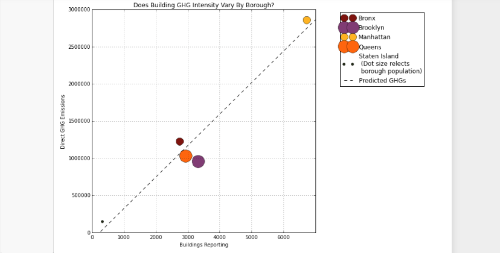

The graph looks simple and clean but there are a couple of points that can be improved. First, I'd suggest placing the legend inside the graph, perhaps upper left or bottom right corner of the chart. The 2 dots inside the legend for each variable appears to be distracting when there's only one for each on the graph. This can be changed using plt.legend(scatterpoints = 1). The axis needs a measure metric unit, which would make it easier to read. The selection in the constrasting color and size are sufficient; the symbology for Staten Island however would be appealing if it was a different color with a black outline, rather than just a black dot. Instead of using abbreviations GHG for the title, I think Greenhouse Gas Emissions would catch someone's attention more.