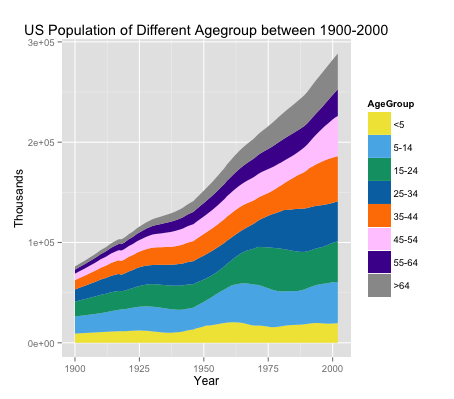

The graph looks very clean and easy to read. First, I'd suggest to change the measure units on the y-axis. It seems a bit confusing with thousands 3e+05, maybe it can be changed to millions or some other relevant measurements. While the colors for age groups are very easy to distinguish, my personal suggestion would be to use only 1/2 colors theme with different shades (example: red to white) so the colors wouldn't appear too busy. The titles and units would look cleaner in the same color (either all grey or all black). I'd take off the empty edges around the chart as well. Other than that the graph looks aesthetically pleasant and emphasizes a great point!