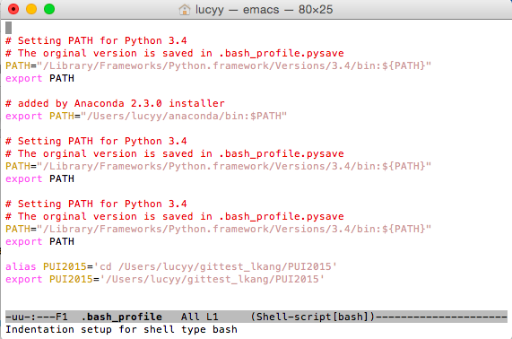
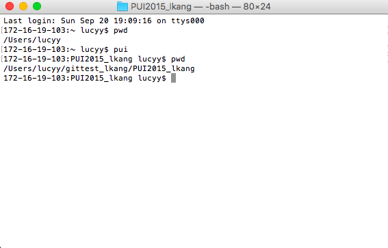

# PUI2015_lkang

Here is what I did to set up my environment.

I created a directory PUI2015 into my directory which came out to be /Users/lucyy/gittest_lkang/PUI2015. 

In the bash_profile emacs window I created an alias using the cd command to get into my directory. 
I then created an environmental variable $PUI2015 and assigned the path to my directory so that every time I open a new terminal it knows what the $PUI2015 env var is set to.

In my terminal, I entered 'pwd' which directs me to /Users/lucyy. PUI2015 then leads me to the location of the file. By entering 'pwd' again, the path of the directory location = /Users/lucyy/gittest_lkang/PUI2015. 

